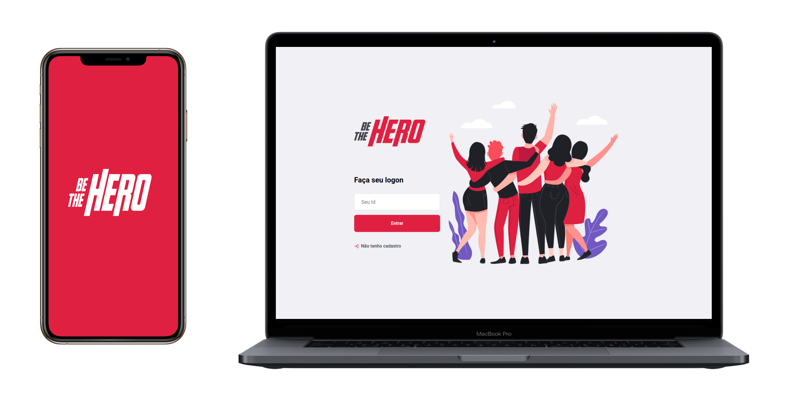
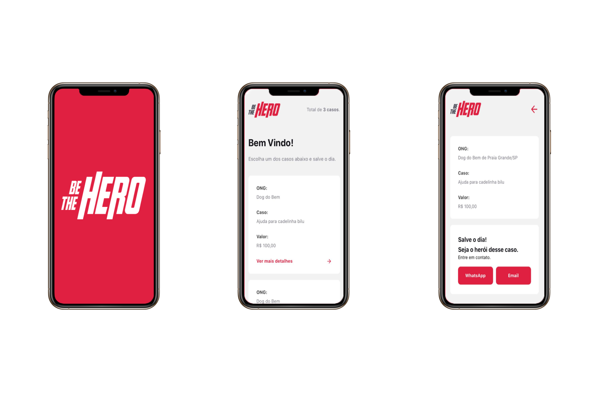
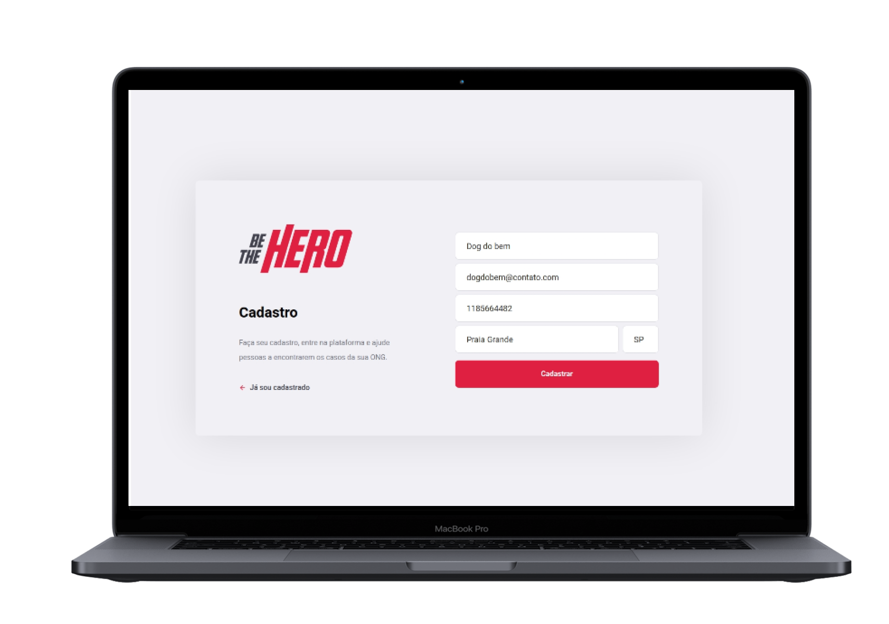
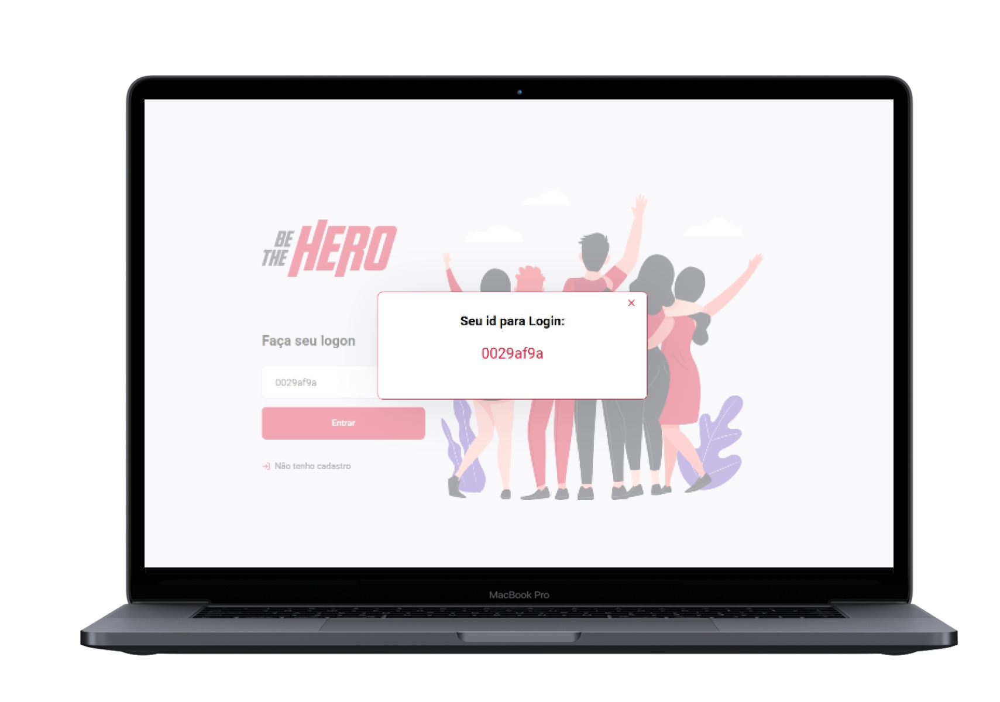

<h1  align="center">


</h1>

  

<p  align="center">



</p>

  

<h4  align="center">

Semana OmniStack 11.0

</h4>

  

<p  align="center">

<a  href="#telescope-projeto"> Projeto</a>&nbsp;&nbsp;&nbsp;|&nbsp;&nbsp;

<a  href="#computer-tecnologias"> Tecnologias</a>&nbsp;&nbsp;&nbsp;|&nbsp;&nbsp;&nbsp;

<a  href="#-preview">Preview</a>&nbsp;&nbsp;&nbsp;|&nbsp;&nbsp;&nbsp;

<a  href="#-getting-started"> Getting Started </a>

  

</p>

  

##  Projeto

  

<b>Be The Hero</b> foi a aplicação desenvolvida durante a Semana OmniStack 11, evento realizado pela [Rocketseat](https://rocketseat.com.br/), nesta edição desenvolvemos uma aplicação onde o intuito é ajudar as ONGs divulgarem os casos que necessitam de uma ajuda financeira através de uma aplicação web, interessado conseguem ver os casos publicados via o app, e caso sinta a vontade de ajudar existem links que facilitam a comunicação redirecionando para o whatsApp ou o e-mail.

  

##  Tecnologias

  

**Backend**

  

- [NodeJs;](https://nodejs.org/en/)

- [Express;](https://www.express.com/)

- [Socket-io;](https://socket.io/)

- [SqLite;](https://www.sqlite.org/index.html)

- [Knex;](http://knexjs.org/)

- [Jest.](https://jestjs.io/pt-BR/)

  

**Frontend**

  

- [React Js;](https://pt-br.reactjs.org/)

- [Styled-Components;](https://styled-components.com/)

- [Axios.](https://github.com/axios/axios)

  

**Mobile**

  

- [React Native;](https://facebook.github.io/react-native/)

- [Expo;](https://expo.io/)

- [Axios;](https://github.com/axios/axios)

  

## Preview

  

<p  align="center">



</p>

  

<p  align="center">



</p>

  

<p  align="center">



</p>

  

<p  align="center">


</p>

  

## Getting Started

  

Você precisa clonar o repositório e pode fazer isso digitando em seu terminal `$ git clone https://github.com/lucaszarza/Be-the-Hero.git`.

  

### Backend

  

Logo após clonar o repositório navegue ate a pasta backend `$ cd backed/` e execute o comando `yarn install` ou `npm install`.

  

Após as dependências terminarem de instalar execute `$ npx knex migrate:latest` , isso ira executar as migrations necessárias para criar o banco de dados.

  

> Caso deseje realizar os testes, execute `$ yarn test` ou `$ npm test`, irá exibir em seu terminal o resultado dos testes.

  

Logo após seguir tudo que foi feito acima pode executar o comando `yarn start` ou `npm start` e deverá aparecer algo parecido com essa mensagem:

  

```

[SERVER] Server is running on http://localhost:3333

```

  

> O fronted e o mobile necessita do backend funcionando para ter seu funcionamento normal!

  

### Frontend

  

Após seguir os passos acima e o backend estiver funcionando vá para pasta `$ cd frontend/` e execute `yarn install` ou `npm install`.

  

Depois das dependências terminarem de instalar execute o comando `yarn start` ou `npm run start`.

  

### Mobile

  

Para executar o mobile entre na pasta `$ cd mobile/` e logo após o backend estiver funcionando, execute `yarn install` ou `npm install`.

  

Após as dependências terminarem de baixar execute `yarn start` ou `npm start` e ai o expo já estará funcionando para você ler o Qr Code e utilizar a aplicação.

  

---

  

<h5  align="center">  Semana OmniStack 11.0</h5>

  

---